<p align="center">
  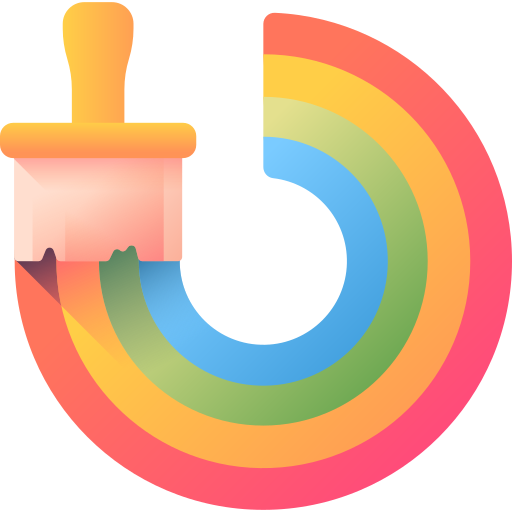
</p>

# CSS Tips Tricks

A handmade collection of pro css tips tricks 🌟

- [Contributing](#contributing)
- [Support](#support)
- [License](#license)


## Table of Contents

1. [Create Documentation Styled Layout](#create-documentation-styled-layout)
1. [Make Webpages Scroll Smoothly](#smooth-scrolling)
1. [Adding Stroke to Text](#adding-stroke-to-text)
1. [Check If Selector Is Supported](#check-if-selector-is-supported)
1. [Check If Property Is Supported](#check-if-property-is-supported)
1. [Play and Pause Animations](#play-and-pause-animations)
1. [Improve Media Defaults](#improve-media-defaults)
1. [Make text readable on images](#make-text-readable-on-images)
1. [Style Optional Form Elements](#style-optional-form-elements)
1. [The Custom Cursors](#the-custom-cursor)
1. [Move Table Caption to the bottom](#move-table-caption-to-bottom)
1. [Create Text Columns](#create-text-columns)
1. [Styling video states via :paused and :playing pseudo classes](#styling-video-states-via-paused-and-playing-pseudo-classes)
1. [Change Writing Mode](#change-writing-mode)
1. [Providing Fallback Values for Variables](#providing-fallback-values-for-variables)
1. [Zooming Images on Hover](#zooming-images-on-hover)
1. [Emphasizing Text Content](#emphasizing-text-content)
1. [Create Gradient Shadows](#create-gradient-shadows)
1. [Five Ways of Centering Divs](#five-ways-of-centering-divs)
1. [Fill Text With Images](#fill-text-with-images)
1. [Style Drop Caps](#style-drop-caps)
1. [Add Leading Zeros to Ordered Lists](#add-leading-zeros-to-ordered-lists)
1. [Using Emoji as List Style Type](#using-emoji-as-list-style-type)
1. [Adding Indentation to Text](#adding-indentation-to-text)
1. [Add Dark Mode Support on Your Website](#using-emoji-as-list-style-type)
1. [Disable Textarea Resizing](#disable-textarea-resizing)
1. [Rainbow Animation](#rainbow-animation)
1. [Use clamp() for Responsive Typography](#disable-textarea-resizing)
1. [Create A Sticky Footer](#create-a-sticky-footer)

### Create Documentation Styled Layout

You can craft a responsive documentation-styled layout using CSS grid with only two lines of CSS.

```html
<div class="parent">
    <aside>Sidebar</aside>
    <main>Documentation</main>
</div>
```

```css
.parent{
  display: grid;
  grid-template-columns: minmax(150px, 25%) 1fr;
}
```

<details>

<summary>See result</summary>

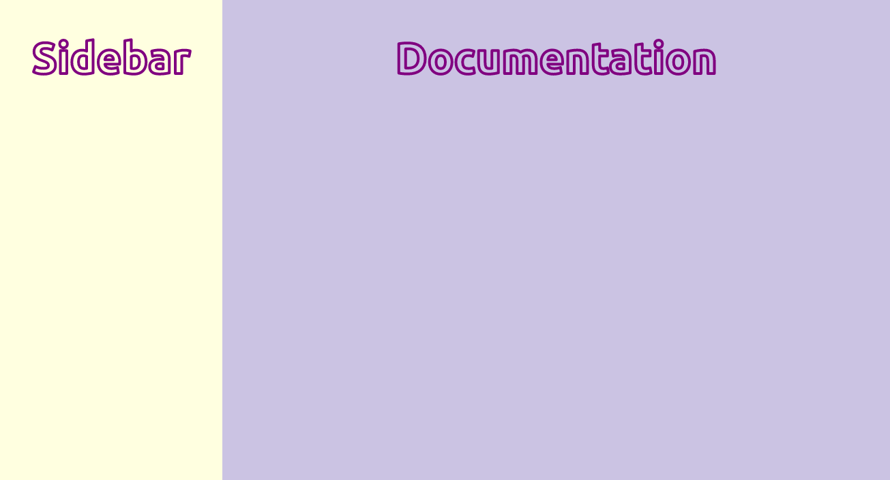


</details>


<sup>[back to table of contents](#table-of-contents)</sup>


### Smooth Scrolling

For implementing smooth scrolling for a page add `scroll-behavior: smooth` to the html element.

```css
 html {
  scroll-behavior: smooth;
}
```

<details>

<summary>See result</summary>


</details>


<sup>[back to table of contents](#table-of-contents)</sup>


### Adding Stroke to Text

Use `text-stroke` property it adds a stroke or outline to the text elements.

```css
/* Width and color values */
h1 {
  -webkit-text-stroke: 5px crimson;
  text-stroke: 5px crimson;
}
```

<details>

<summary>See result</summary>

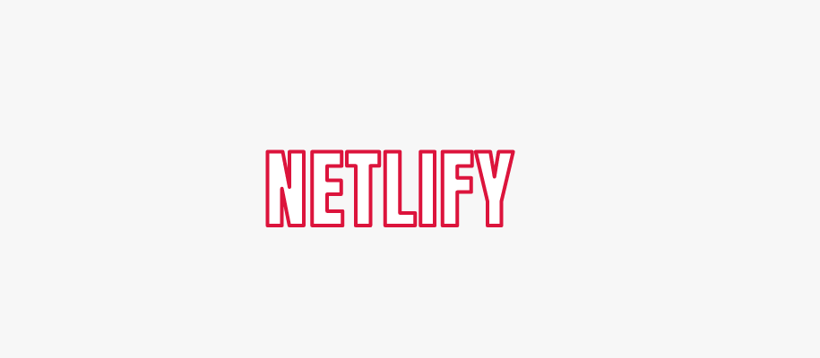


</details>

<sup>[back to table of contents](#table-of-contents)</sup>


### Check If Selector Is Supported

You can check if a selector is supported by your browser or not using the `selector()` within the `@supports` rule.

```css
@supports (selector(div:has(pre))) {
/* Code that will only run if the selector is supported */
  p {
    color: crimson;
  }
}
```

<sup>[back to table of contents](#table-of-contents)</sup>

### Check If Property Is Supported


You can also detect properties support using the CSS `@supports` rule.

```css
@supports (display: grid) {
   main {
    display: grid;
  }
}
```

 Chris Coyier has done an exceptional job of providing valuable insights and information on the `@supports` rule, Also Known as Feature queries. Read [here](https://css-tricks.com/how-supports-works/).

<sup>[back to table of contents](#table-of-contents)</sup>

### Play and Pause Animations

Use the `animation-play-state` property to play and pause an animation.
For example: Playing an animation on hover.

```css
/* By default animation is paused */
.box {
  animation-name: rotate;
  animation-duration: 0.7s;
  animation-iteration-count: infinite;
  animation-play-state: paused;
}

/* Play animation on hover */
.box:hover {
  animation-play-state: running;
}

@keyframes rotate {
  0% {
    transform: rotate(0);
  }
  100% {
    transform: rotate(360deg);
  }
}

```

<details>

<summary>See result</summary>

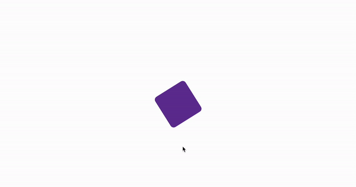

</details>

<sup>[back to table of contents](#table-of-contents)</sup>


### Improve Media Defaults

Images are inline elements, and by setting the default value to `display:block;` we can avoid many potential issues. Setting `max-width:100%;` we prevent images from overflowing when they are in a container that is not wide enough to contain them.

```css
img, picture, video, svg {
  display: block;
  max-width: 100%;
  object-fit: contain;
}
```

Additionally, I have set `object-fit:contain;` to ensure that images preserve a nice aspect ratio.


<sup>[back to table of contents](#table-of-contents)</sup>

### Make text readable on images

Add linear-gradient overlay on your images to make your text content readable and accessible for users.

```css
.header {
  background-image: linear-gradient(#ffffffa2, #ffffffe6),url("images/hero-bg.jpg");
}
```
<details>

<summary>See result</summary>


#### Not using gradient

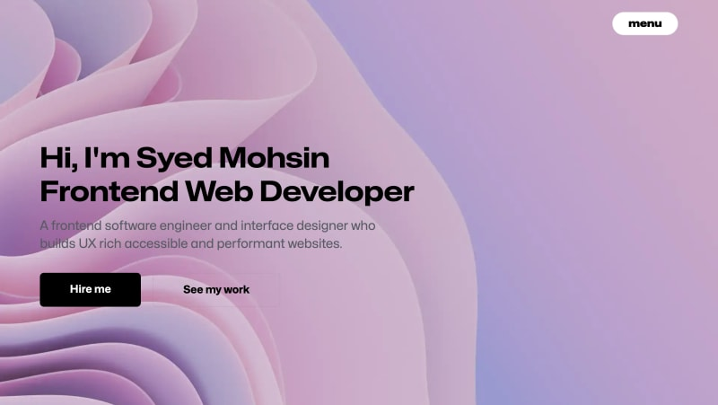  

#### Uses gradient

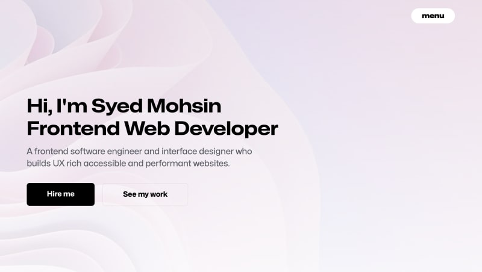

</details>


<sup>[back to table of contents](#table-of-contents)</sup>

### Style `:optional` Form Elements

You can style form fields like `input`, `select`, and `textarea` that do not have a required attribute on them using the `:optional` pseudo-class.

```css
/* Selects all optional form fields */
*:optional{
  background-color: green;
}
```

**Note:** Use `:required` pseudo-class to select required form fields.

<sup>[back to table of contents](#table-of-contents)</sup>


### The Custom Cursor

You can customize your `cursor` from an arrow pointer to a custom image.

```css
html{
  cursor: url('images/no.jpg'), auto;
}
```

**Note:** `auto` will be used as fallback value in case image does not load for some reason.

<details>

<summary>See result</summary>

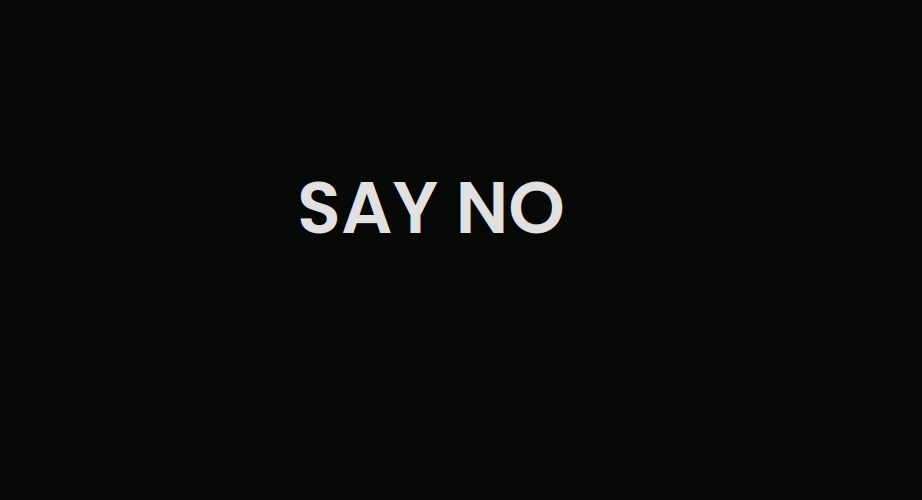


</details>

<sup>[back to table of contents](#table-of-contents)</sup>


### Move Table Caption to Bottom

Use the `caption-side` property to place the table caption or table title on a specified side of the table.

```css
table{
  caption-side: bottom;
}
```

<details>

<summary>See result</summary>


</details>

<sup>[back to table of contents](#table-of-contents)</sup>


### Styling video states via `:paused` and `:playing` pseudo classes

Use `:paused` selector to style media elements like audio, and  video when in paused state likewise paused we also have `:palying` pseudo-class selector.

```css
video:paused {
  opacity: 0.6;
}
```

**Note:** At the moment, this feature is only supported in Safari, but you can use this helpful [tool](https://caniuse.com/) to check for the latest support across different browsers.

<details>

<summary>See result</summary>


</details>

<sup>[back to table of contents](#table-of-contents)</sup>


### Create Text Columns

Craft nice column layouts for text elements using column properties.

```css
p{
  column-count: 3;
  column-gap: 4.45rem;          
  column-rule: 2px dotted crimson;
}
```

<details>

<summary>See result</summary>

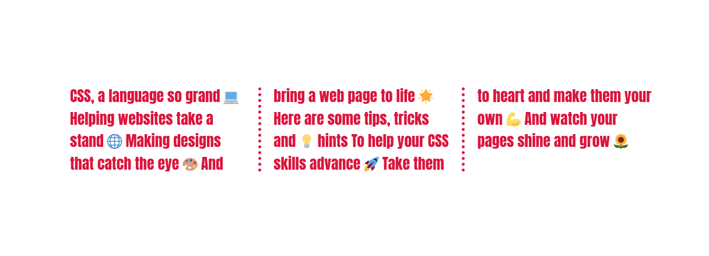


</details>


<sup>[back to table of contents](#table-of-contents)</sup>


### Change Writing Mode

You can use the `writing-mode` property to specify how text should be laid out on your website.

```css
/* Specifies the text layout direction to sideways-lr  */
h1 {
  writing-mode: sideways-lr;
}

/* Keyword values (Reference: MDN)  */
writing-mode: horizontal-tb;
writing-mode: vertical-rl;
writing-mode: vertical-lr;

```

<details>

<summary>See result</summary>

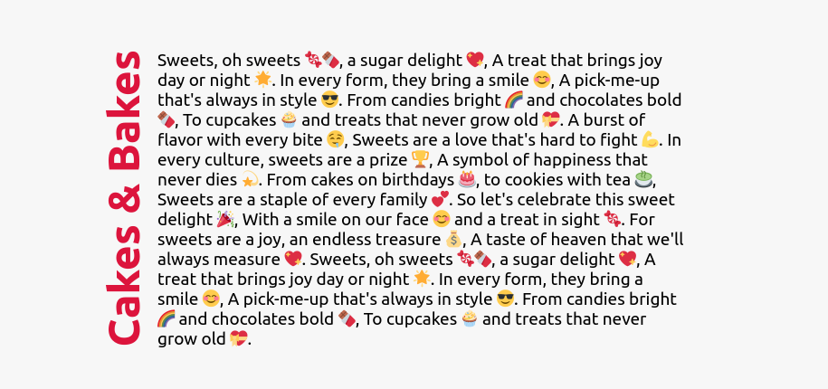


</details>


<sup>[back to table of contents](#table-of-contents)</sup>


### Providing Fallback Values for Variables

Specify fallback values for custom properties. In case a variable is not defined or found for some reason the fallback value will be used.

```css
/* Purple color will be applied as var(--black) is not defined */
:root {
  --orange: orange;
  --coral: coral;
}

h1 {
  color: var(--black, purple);
}
```

<sup>[back to table of contents](#table-of-contents)</sup>


### Zooming Images on Hover


You can create a zoom-in effect when hovering over an image, this is a technique commonly used on e-commerce websites.

```css
/* Define the height and width of the image container & hide overflow */
.img-container {
  height: 250px; width: 250px; overflow: hidden;
 }

/* Make the image inside the container fill the container */
.img-container img {
  height: 100%;
  width: 100%;
  object-fit: cover; 
  transition: transform 200ms ease-in;
 }

 img:hover{
  transform: scale(1.2);
 }
```

<details>

<summary>See result</summary>

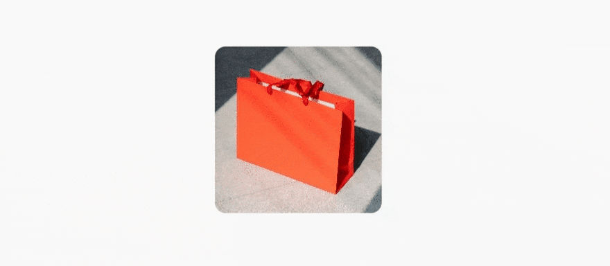


</details>


<sup>[back to table of contents](#table-of-contents)</sup>

### Emphasizing Text Content

Use `text-emphasis` property to apply emphasis marks to text elements.You can specify any string including emojis as its value.

```css
h1 {
  text-emphasis: "⏰";
}
```
**Note:** Please refer to [MDN](https://developer.mozilla.org/en-US/docs/Web/CSS/text-emphasis) docs to learn more about this property.


<details>

<summary>See result</summary>

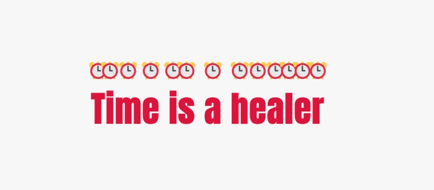

</details>

<sup>[back to table of contents](#table-of-contents)</sup>

### Create Gradient Shadows

This is how you can create gradient shadows for an exclusive user experience.

```css
:root{
  --gradient: linear-gradient(to bottom right, crimson, coral);
}

div {
  height: 200px;
  width: 200px;
  background-image: var(--gradient);
  border-radius: 1rem;
  position: relative;
}

div::after {
  content: "";
  position: absolute;
  inset: 0;
  background-image: var(--gradient);
  border-radius: inherit;
  filter: blur(25px) brightness(1.5);
  transform: translateY(15%) scale(0.95);
  z-index: -1;
}
```

<details>

<summary>See result</summary>


</details>


<sup>[back to table of contents](#table-of-contents)</sup>


### Five Ways of Centering Divs

Center a `div` both vertically and horizontally.

```css
/* 1.Centering with grid */
.parent{
  height: 100vh;
  display: grid;
  place-items: center;
}

/* 2.Centering with grid & margins */
.parent{
  display: grid;
}
.child{
  margin: auto;
}
```

```css
/* 3.Centering with positioning */
div{
  position: absolute;
  top: 50%;
  left: 50%;
  transform: translate(-50%,-50%);
}
```

```css
/* 4.Centering with flexbox  */
.parent{
  height: 100vh;
  display: flex;
  justify-content: center;
  align-items: center;
}

/* 5.Centering with flexbox & margins */
.parent{
  display: flex;
}
.child{
  margin: auto;
}
```


**Note:** When using layout tools like `grid`, `flexbox` or positioning elements are centered relative to the height of the parent element which is `100vh` here in our case, Also check out this great [article](https://web.dev/viewport-units/) by [@bramus](https://github.com/bramus) on using new viewport units. 

<sup>[back to table of contents](#table-of-contents)</sup>


### Fill Text With Images

You can fill your text content with a beautiful image with a few lines of CSS.

```css
h1{
  background-image: url('images/flower.jpg');
  background-clip: text;
  color: transparent;
  background-color: white;
}
```

**Note:** Always specify `background-color` when using this technique as this will be used as a fallback value in case the image does not load for some reason.

<details>

<summary>See result</summary>

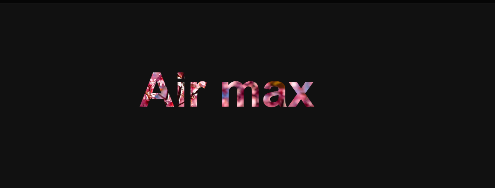


</details>

<sup>[back to table of contents](#table-of-contents)</sup>


### Style Drop Caps 

Avoid unnecessary spans and use pseudo elements instead to style your content likewise `first-letter` pseudo-element we also have `first-line` pseudo-element.

```css
 h1::first-letter{
  font-size: 2rem;
  color:#ff8A00;
}
```

<details>

<summary>See result</summary>


</details>


<sup>[back to table of contents](#table-of-contents)</sup>


### Add Leading Zeros to Ordered Lists

Enhance visual consistency and readability by adding leading zeros to the numbers in your ordered list items.


```css
li{
  list-style-type:decimal-leading-zero;
}
```


<details>

<summary>See result</summary>

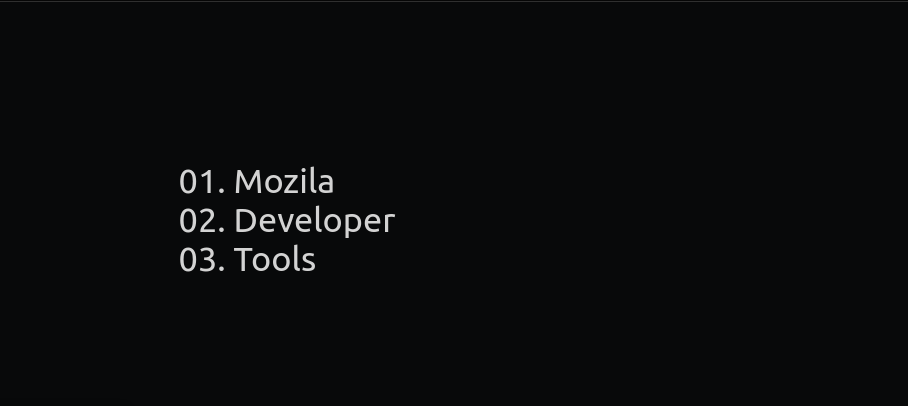

</details>

<sup>[back to table of contents](#table-of-contents)</sup>

### Using Emoji as `list-style-type`

You can use emojis as list style types It's a fun way to add some personality to your lists.

```css
li{
  list-style-type: '🐶';
}
```

<sup>[back to table of contents](#table-of-contents)</sup>

### Adding Indentation to Text

Use the `text-indent` property to indent the first line of a text block. Negative values are also allowed.

```css
p{
  text-indent:2.6rem;
}
```

<details>

<summary>See result</summary>

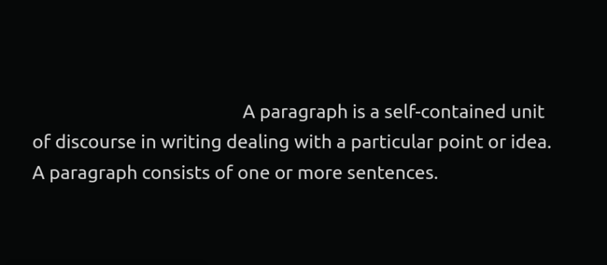

</details>

<sup>[back to table of contents](#table-of-contents)</sup>


### Add Dark Mode Support to Your Website

You can add dark mode support to your website using CSS variables and the `prefers-color-scheme` media query.


```css
:root {
  --bg-color: white;
  --text-color: black;
}

body {
  background-color: var(--bg-color);
  color: var(--text-color);
}

@media (prefers-color-scheme: dark) {
  :root {
    --bg-color: black;
    --text-color: white;
  }
}
```
### Disable Textarea Resizing

Prevent textarea resizing by setting the `resize` property to `none`.

```css
textarea{
  resize:none;
}
```

<sup>[back to table of contents](#table-of-contents)</sup>

### Rainbow Animation

Creates a continuously looping color animation for elements.

```css
button{
  animation: rainbow-animation 200ms linear infinite;
}

@keyframes rainbow-animation {
  to{
    filter: hue-rotate(0deg);
  }
 from{
    filter: hue-rotate(360deg);
  }
}
```

```css
/* If the user prefers reduced motion, then don't use any animations on button */
@media (prefers-reduced-motion: reduce) {
  button {
    animation: none;
  }
}
```

**Note:** When working with animations  make use of `prefers-reduced-motion` media feature to make sure that your website is accessible for the users who may have any vestibular disorders. Give this [gem](https://web.dev/prefers-reduced-motion/) a read written by [@tomayac](https://github.com/tomayac).

<details>

<summary>See result</summary>

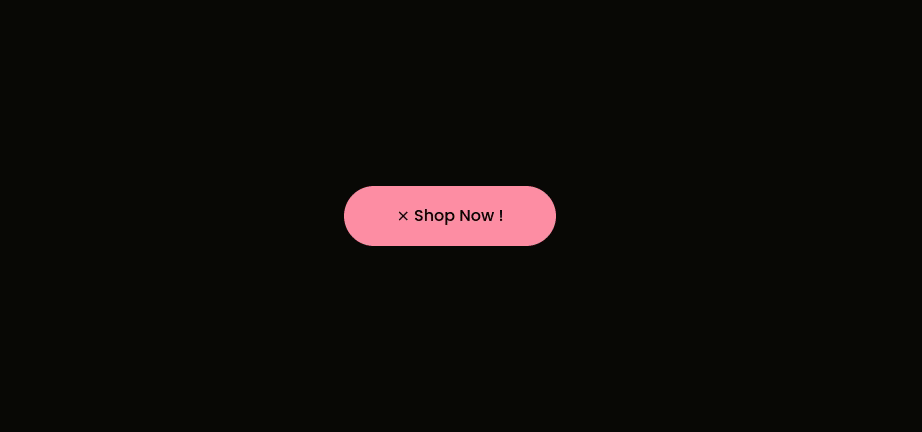

</details>

<sup>[back to table of contents](#table-of-contents)</sup>

### Use `clamp()` for Responsive Typography

Instead of using media queries for responsive and fluid typography use the `clamp()` function. 

```css
/* Syntax: clamp(minimum, preferred, maximum) */
h1{
  font-size: clamp(2.25rem,6vw,4rem);
}
```

<details>

<summary>See result</summary>

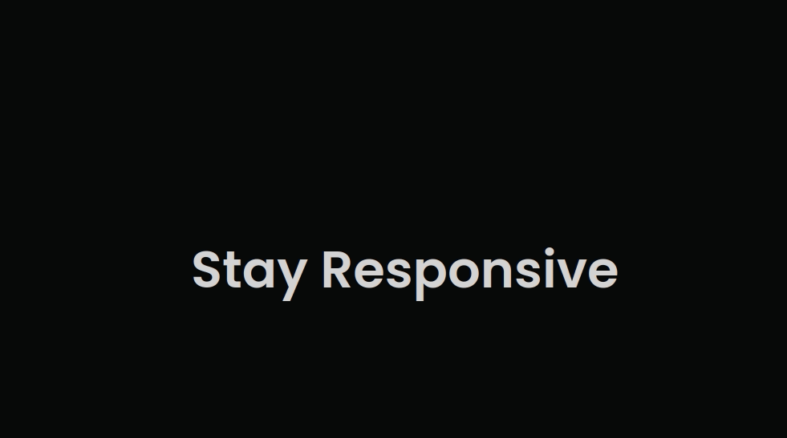

</details>

<sup>[back to table of contents](#table-of-contents)</sup>

### Create A Sticky Footer

You can create a `footer` that always stick to the bottom of the browser window with only a few lines of CSS.

```html
<div class='layout'>

  <main>
     <!-- your content here -->
  </main>

  <footer>
     <!-- your footer content here -->
  </footer>

</div>
```

```css
.layout{
  height: 100vh;
  display: flex;
  flex-direction: column;
}

footer{
  margin-top: auto;
}
```

<details>

<summary>See result</summary>

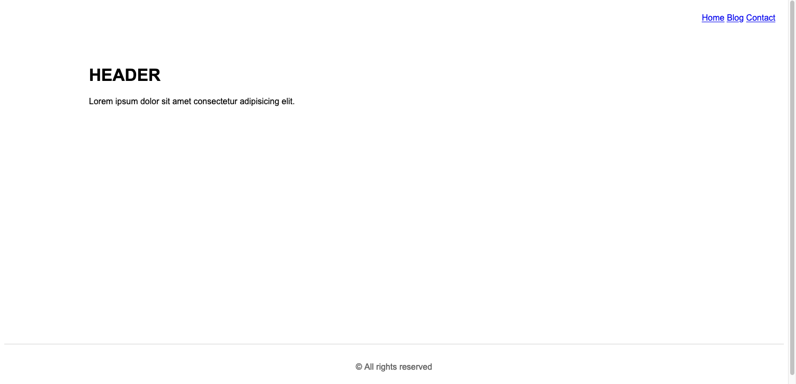

</details>

<sup>[back to table of contents](#table-of-contents)</sup>


## Contributing

If you have a CSS tip or trick that you'd like to share with the community, I'd love to hear from you!

When submitting a pull request, please be sure to include a **detailed description** of the tip or trick, along with a **code snippet** and any relevant **images**.

<sup>[back to table of contents](#table-of-contents)</sup>

## Support

Please consider supporting this project. Your support enables me to continue working on this project and creating more resources in the future.

If you encounter any issues or have questions about this project, please feel free to reach out to me for support. You can contact me via email at devsyedmohsin@gmail.com.

<sup>[back to table of contents](#table-of-contents)</sup>

## License

This project is licensed under the [MIT License](https://github.com/git/git-scm.com/blob/main/MIT-LICENSE.txt).

<sup>[back to table of contents](#table-of-contents)</sup>
